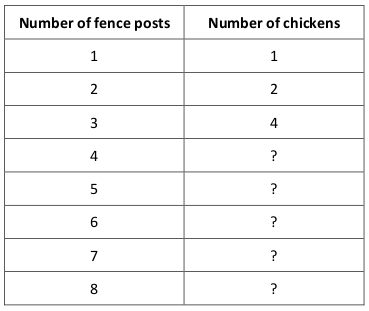
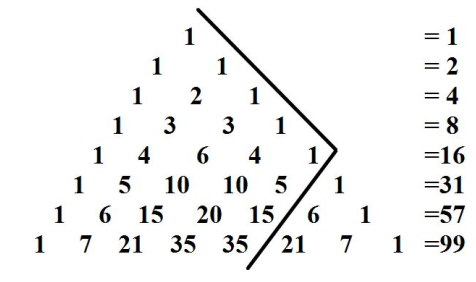

# Counting Chickens

## Introduction

This activity looks at the interesting concept of having a circle with n points on its perimeter and what happens when you joint those points up.   

Three examples are given on the question sheet so students can see how to visualize the problems. The activity questions rely on students being able to develop on these primary examples to solve more complicated cases. The extension looks at spotting a pattern and developing a rule.   

It is advisable that students try drawing out each case. It should be noted that the use of colours can be a
way for students to picture the different regions more easily.

## Solution

## Extension

Is there a pattern between the number of fence posts and the maximum number of chickens that can be kept?   

Hint: Fill out this table (some of it has been filled out for you)   

   

Using Pascal’s triangle, what will happen if you add the numbers to the left of the line in each row? Can
you spot the pattern now? Can you explain this strange pattern?    

 