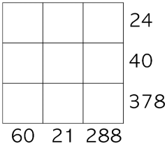
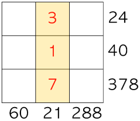
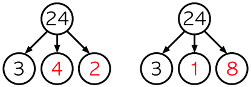
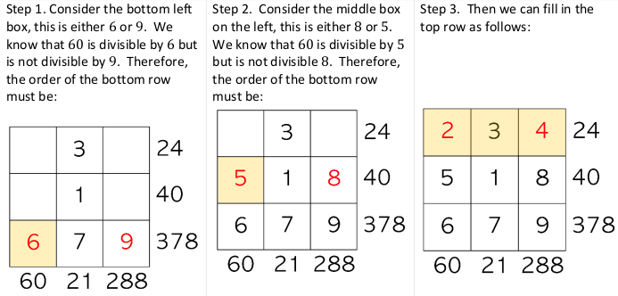
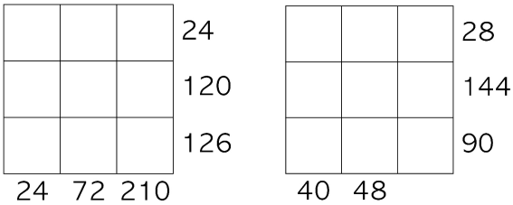
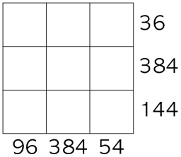

# Gabriel's Problem

## Introduction  

This problem will get students to think methodically and will get them
to develop a strategy for considering each of the different cases. You
should let learners work out the factors of each row and column before
assisting them with considering each of the cases.  

Get students to start by drawing this grid:  

## Solution  

Notice that there is only one combination of factors that multiply together to get 21, so we start here. In fact, 21 = 1 × 3 × 7. We
know, that the middle column therefore has the numbers 1, 3 and 7.  
Consider these three numbers as factors of each row:  

    •24 is divisible by 1 and 3  

    •40 is divisible by 1  

    •378 is divisible by 1 and 7  

40 is not divisible by 3 or 7 and so 1 
should go in the middle box. Then
that leaves 3 to go in the top box and 7 in the bottom box.  

Now we can look at each row in turn to find the possible factors.

  

<ins>Row 1<ins>  

We know that the numbers in this row must multiply together to get 24. The number 3 is one of those
numbers. So, consider what other two numbers could be:  

  

Notice that 1 has already been used in the second row of the grid, leaving us with the first combination of
factors. Therefore, 4 and 2 go in the remaining two boxes in the first row.  

<ins>Row 2<ins>   

Again, we know that the numbers in this row must multiply together to get 40. The number 1 is one of
those numbers. So, the other two numbers are:   

  

Therefore, 5 and 8 go in the remaining two boxes in the second row.  

<ins>Row 3<ins>   

We take a different approach to this row than we did for the others. Out of the possible numbers 1-9, we have already used 1, 2, 3, 4, 5, 7 and 8. Which means that 6 and 9 are the only two numbers left and therefore must go in the remaining two boxes in the final row.  

We need to work out the order now.

  

Check for yourself that this is correct

## Extension  

Can you also fill out these grids? One of them has more than one solution:  

  

For this grid, Gabriel used the numbers 1, 2, 3, 4, 5, 6, 9, 10 and 12.   

   

Gabriel used the numbers 1, 2, 3, 4, 6, 8, 9, 12 and 16 to make this grid. How many solutions can you find? Is this grid easier or harder to complete the ones above? Why do you think this is the case?  

   

You can also make your own 3x3 grids and swap them with friends. Try to solve each other’s grids!

