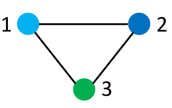
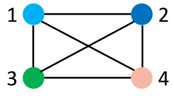

# Handshake Puzzles

## Introduction  

This can be done by students thinking about it in their heads or they can arrange themselves into groups of
1, 2, 3 etc ... to act out the different scenarios and count the number of handshakes they make.  

For this puzzle we will assume that a handshake is shared i.e.. that if person A shakes the hand of person B,then person B has already shaken the hand of person A. The handshake should not be counted twice.  

Each stage gets progressively more difficult. The extension section increases the number of people even further with the hope that by considering more cases, students will start to look for a pattern.

## Solution  

<ins>Stage 1<ins>

There are only two people at a party. Once they have shaken hands with each other there is no one left at the party to shake hands with. The total number of handshakes is 1.  

2 people, 1 handshake.  

<ins>Stage 2<ins>  

There are three people at a party. The first person shakes hands with the other two people. The second person has already shaken hands with the first person, but he can still shake hands with the third person. Person three has already shaken hands with everybody at the party, so there are no additional handshakes. So, the total number of handshakes is 2 + 1 + 0 = 3.  

3 people, 3 handshakes.  

<ins>Stage 3<ins>  

There are four people at a party. The first person can shake hands with three people, the second person can shake hands with two additional people and the third
person can shake hands with one additional person. Person four has already shaken hands with everybody at
the party, so they have no additional handshakes. So, the total number of handshakes is 3 + 2 + 1 + 0 = 6.  

4 people, 6 handshakes.

## Extension  

Ask the students to record their results in a table and fill in values for up to 8 people.Can you spot a pattern in the numbers? Can you find a general rule for n people at a party? Use this to work out how many handshakes there would be if there were 30 people attending the party.

