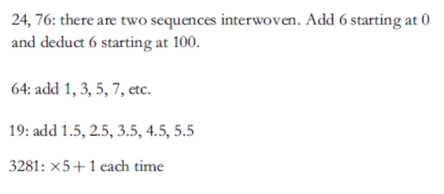

# IQ Challenge

## Introduction
IQ challenges encourage people to think in different ways. The most important thing when doing these is to not let learners immediately give their answers to each other, instead let everybody attempt all the questions and then discuss with each other and the class later. 

## Solution
1. The answers and rules for the first question are as follows:

2. The second question needs you to find a way that you can relate the three outer numbers to the inner number. If you add the two larger numbers and subtract the smaller, the answer is 3 times the middle number. Therefore missing number is 11: 
 

3. The third question challenges visualization and special awareness skills. Learners may find it easier to break the solution down into several parts. The answer is 50:
 

## Extension
Learners could design some of their own challenges to give each other. They could also try to grade the difficulty of their challenges as easy, medium or hard.  
