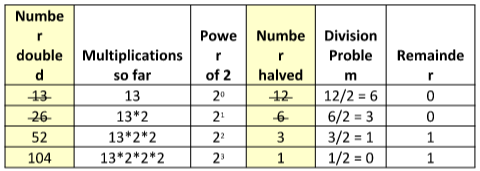

# Russian Multiplication

## Introduction
This is an interesting method to do multiplications – involving only halving, doubling and adding.  

Work through the 22 x 19 example in a traditional way and then the method described. Both ways should give the answer 418.  

Then try some other multiplications, e.g. 25 x 37. Students should be keen to test their own multiplications and see if this process always seems to work.

## Solution  

It will work for any two numbers. An insight into why it always works can be given by trying multiplications where one of the numbers is a power of two, e.g. 30 x 36 or 30 x 64 or 30 x 128. 

## Extension

**Understanding how Russian peasant multiplication is related to binary numbers**  

(taken from http://mathforum.org/dr.math/faq/faq.peasant.html)   

Binary numbers are numbers written in [base two](https://mathforum.org/dr.math/faq/faq.bases.html) instead of base ten. This means that place value depends on powers of two instead of powers of ten: instead of ones, tens, and hundreds places, base two has a ones place, a twos place, a fours place, and so on. For example, fourteen in base two is 1110:  

        1110 (base 2)
  
        = 1 * $2^3$ + 1 * $2^2$ + 1 * $2^1$ + 0 * $2^0$
  
        = 8 + 4 + 2 + 0
  
        = 14.  

Russian peasant multiplication is actually a quick way to convert two numbers to binary form, multiply them together, and convert back to our number system. The connection is not surprising, because binary numbers use base two, and Russian peasant multiplication depends on multiplying and dividing by two. To see the connection more clearly, let's investigate the problem 12*13.  

**Halving**  

You can convert a number to binary form by repeatedly dividing by two and keeping track of the remainders. Let's try 12:  

        12/2 = 6 remainder 0  

        6/2 = 3 remainder 0  

        3/2 = 1 remainder 1  

        1/2 = 0 remainder 1.  

Reading the remainders from bottom to top, we get 1100, so 12 in base two is 1100.  

Why does this conversion method work? Let's try cutting twelve in half again, the same way. This time, we'll write everything in base two. (Naturally, 2 in base two is 10.)  

        1100/10 = 110 remainder 0  

        110/10 = 11 remainder 0  

        11/10 = 1 remainder 1  

        1/10 = 0 remainder 1.  

Dividing by two and then taking the remainder gives us a number's last digit in binary notation.  

Here's what we know about 12, so far:  

        12 = 1100 (base 2)  

        = 1*$2^3$ + 1*$2^2$ + 0*2+ 0*1  

        = $2^3$ + $2^2$  

        = 8 + 4.  

By halving 12 repeatedly, we have broken it down into powers of two.  

**The Distributive Property**  

We are trying to multiply 12 by 13. One way to do this would be to use long multiplication:   

Notice that we are adding 2*13 and 10*13 to get our final answer. This works because of the [distributive property]():  

        12 * 13  

        = (2 + 10) * 13  

        = 2 * 13 + 10 * 13.  

Of course, we can break 12 down any way we like, and still get the right answer. Let's use our previous work to split the problem into powers of two:  

        12 * 13  

        = (4 + 8) * 13  

        = ($2^2$ + $2^3$) * 13  

        = $2^2$ * 13 + $2^3$ * 13.  

If we can multiply 13 by $2^2$ and $2^3$, we will be finished.  

**Doubling**  

Repeatedly doubling a number multiplies it by powers of two. Let's try doubling 13:   

Our chart tells us that 22 * 13 + 23 * 13 = 52 + 104 = 156, so 12 * 13 = 156, and we are done.  

**Putting It All Together**  

We just used repeated halving and doubling to convert 12 to binary form, then multiply it by 13. Russian peasant multiplication does the same thing, but because it leaves out several steps, the process is much faster. Let's combine our doubling and halving steps to compare the two methods.  

The columns used in Russian peasant multiplication are highlighted. Notice that when the number in the remainder column is 0, the corresponding row for Russian peasant multiplication is crossed out.
