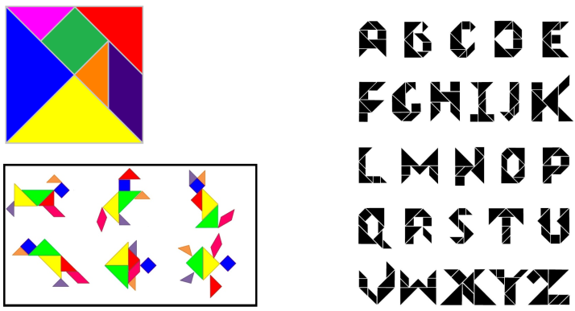

# Tangrams

## Introduction

Tangrams were invented more than 200 years ago, and consist of 7 shapes joined to make a square:   

* 2 large right triangles
* 1 medium-sized right triangle
* 2 small right triangles
* 1 small square
* 1 parallelogram   

They are a great way to explore these shapes, and to also develop the mathematical skill of ‘spatial reasoning’ (thinking about objects and the space they take up and understanding how they could be moved and manipulated).

## Solution

There is no real winning or solution however, here are some ideas of the types of things people might be able to create

## Extension   

You could challenge students to recreate a picture by following instructions. One student creates a picture and hides it. They then have to tell another student steps to recreate it, and see if they match at the end
(the instructor can’t touch the tangram of the creator.)  

You could make even more shapes by using 2 or more sets of tangrams together.